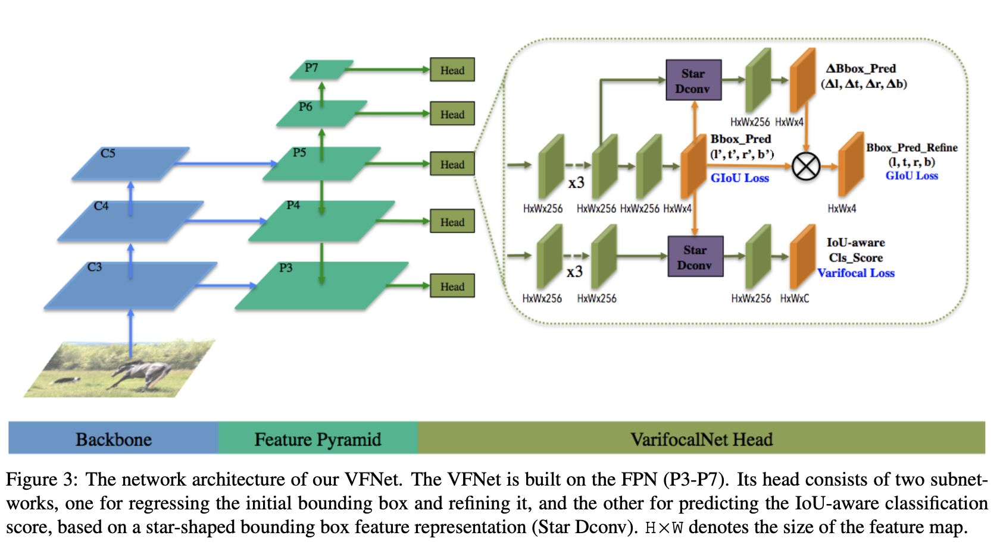

# VFNet with ResNet-18 for Vessel Detection in S-2 Raw Imagery

This project implements a vessel detection system using VFNet with ResNet-18 as the backbone network. The framework is based on MMDet, a powerful open-source object detection toolbox. The goal of this project is to detect vessels in S-2 imagery and provide accurate bounding box predictions.

## Table of Contents

1. [Introduction](#introduction)
2. [Installation](#installation)
3. [Dataset](#dataset)
4. [Training](#training)
5. [Inference](#inference)
6. [Results](#results)
7. [Customization](#customization)
8. [Contributing](#contributing)
9. [License](#license)

## Introduction

The goal of this project is to detect vessels in S-2 Raw imagery and provide accurate bounding box predictions. The project implements a light vessel detection system using VFNet with ResNet-18 as the backbone network. The framework is based on MMDet, a powerful open-source object detection toolbox.



The VFNet with ResNet-18 architecture combines the advantages of VFNet (an effective anchor-free object detection network) and ResNet-18 (a widely-used convolutional neural network architecture). This combination allows for accurate vessel detection in S-2 imagery, leveraging the strong feature representation capabilities of ResNet-18 and the robustness of VFNet.

The MMDet framework provides a comprehensive set of tools for training and evaluating object detection models. It supports various state-of-the-art algorithms and backbone networks, making it suitable for a wide range of computer vision tasks.

## Installation

To set up the project and run the code, please follow these steps:

1. Clone the repository:

```diff
+ git clone https://github.com/sirbastiano/VDS2Raw
# move to the dir:
+ cd VDS2Raw
```

2. Set up the Python environment. It is recommended to use a virtual environment to avoid conflicts with other Python packages. The bash script provided install the environment and also the required dependencies:

```diff
+ source mmdet_install.sh # (Tested on linux and macos)
```

**Note:**  
Make sure you have the necessary CUDA and CUDNN libraries installed if you plan to train the model on a GPU.

## Data

To train and evaluate the vessel detection model, you will need a dataset of vessels in S-2 imagery. Ensure that your dataset is in proper format: 

- Provided image examples: https://zenodo.org/record/7982468#.ZIiLxS8QOo4 
- Repo for handling L0 data: https://github.com/ESA-PhiLab/PyRawS

Place your data in the "input_data" directory.

## Inference

To perform inference and detect vessels in new S-2 imagery, follow these steps:

0. Download weights (https://drive.google.com/file/d/1EUTRbgCrp4X7Ii9p7OiLscQ5u5aMKFZi/view?usp=share_link) and place them in the "checkpoint" directory.

1. Configure the inference settings in the project's configuration file. Specify the path to the trained model checkpoint and any other necessary parameters.

2. Run the inference script:

```diff
+ python inference.py --img_path /path/to/image --threshold 0.5 --device cpu
```
The script will load the trained model, process the input imagery, and generate bounding box predictions for the vessels present in the images in the output_results folder.

3. Evaluate the results and analyze the model's performance on the new imagery.

## Results

After training and evaluating the model, you can analyze the results to assess the model's accuracy and performance. Use evaluation metrics such as precision, recall, and mean average precision (mAP) to measure the model.


